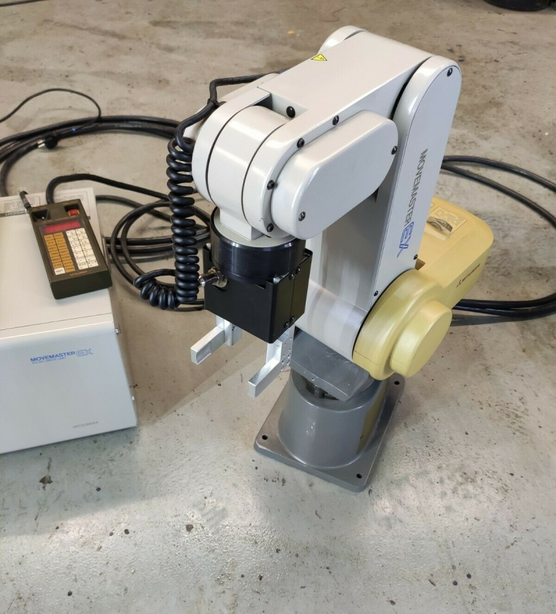

# Movemaster RV M1 c# Library

Control a Mitsubishi Movemaster EX RV-M1 via serial RS232 port in dotnet 



## How to start

```csharp
using (var robot = new MovemasterRobotArm(comportName: "COM15"))
{
    robot.SetToolLength(50);
    robot.SetSpeed(9);
    robot.MoveTo(.0, +420.0, +290, -30, 0);
}
```
