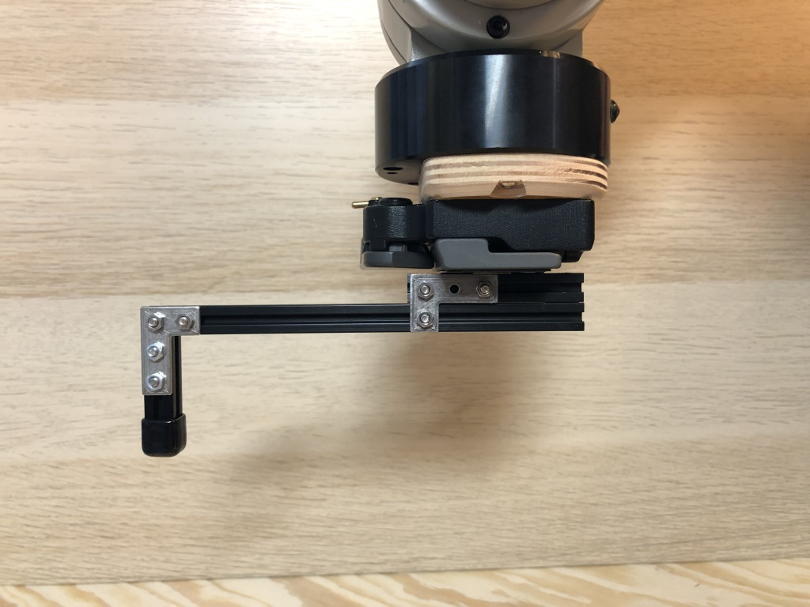
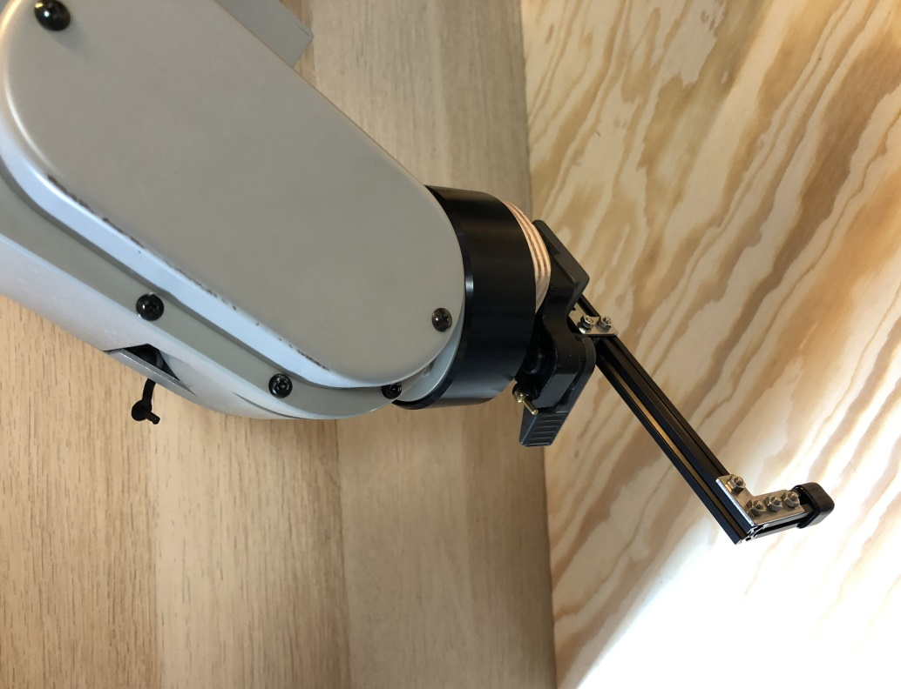

# Movemaster RV M1 c# Library

Control a Mitsubishi Movemaster EX RV-M1 via serial RS232 port in dotnet 


## How to start

```csharp
using (var robot = await MovemasterRobotArm.CreateAsync(comportName: "COM15"))
{
    await robot.SetToolLength(50);
    await robot.SetSpeed(3);
    await robot.MoveTo(.0, +420.0, +290, -30, 0); // away
}
```

## Horizontal extension

The routines for controlling the horizonal extension enable an increase of the reachable space on the horizontal. When using them, the length of the extension to the centre of the robot hand must be specified.




